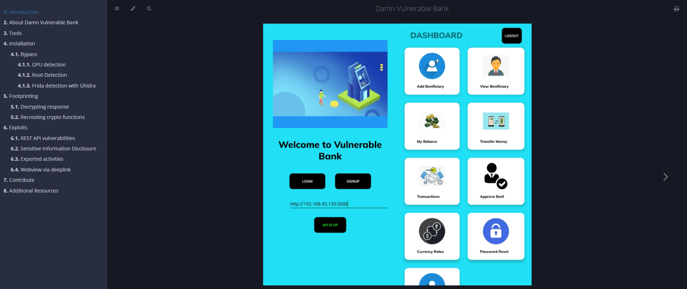

<h1 align="center">Damn Vulnerable Bank</h1>

  
  <a href="https://github.com/TechPhantomSanjai/Project-Fraud-Detection/LICENSE">
    

  <b>Guide: https://github.com/TechPhantomSanjai/Project-Fraud-Detection/</b>

## About application
[Damn Vulnerable Bank](https://github.com/TechPhantomSanjai/Project-Fraud-Detection) is designed to be an intentionally vulnerable android application. All the details are documented in the guide, [here](https://rewanthtammana.com/damn-vulnerable-bank/).

<!--  -->

## Upcoming Sessions

### NoNameCon

* [https://cfp.nonamecon.org/nnc2021/talk/WCKLTN/](https://cfp.nonamecon.org/nnc2021/talk/WCKLTN/)

### Black Hat Europe

* [TBD](https://www.blackhat.com/eu-21/)

## Features
- [x] Sign up
- [x] Login
- [x] My profile interface
- [x] Change password
- [x] Settings interface to update backend URL
- [x] Add fingerprint check before transferring/viewing funds
- [x] Add pin check before transferring/viewing funds
- [x] View balance
- [x] Transfer money
  - [x] Via manual entry
  - [ ] Via QR scan
- [x] Add beneficiary
- [x] Delete beneficiary
- [x] View beneficiary
- [x] View transactions history
- [ ] Download transactions history

## List of vulnerabilities in the application

To keep things crisp and interesting, we hidden this section. Do not toggle this button if you want a fun and challenging experience. Try to explore the application, find all the possible vulnerabilities and then cross check your findings with this list.

  
Spoiler Alert

- [x] Root and emulator detection
- [x] Anti-debugging checks (prevents hooking with frida, jdb, etc)
- [ ] SSL pinning - pin the certificate/public key
- [x] Obfuscate the entire code
- [x] Encrypt all requests and responses
- [x] Hardcoded sensitive information
- [x] Logcat leakage
- [ ] Insecure storage (saved credit card numbers maybe)
- [x] Exported activities
- [ ] JWT token
- [x] Webview integration
- [x] Deep links
- [ ] IDOR

## Backend to-do

- [x] Add profile and change-password routes
- [ ] Create different secrets for admin and other users
- [ ] Add dynamic generation of secrets to verify JWT tokens
- [ ] Introduce bug in jwt verification
- [x] Find a way to store database and mount it while using docker
- [X] Dockerize environment

## Core Team

[Damn Vulnerable Bank](https://rewanthtammana.com/damn-vulnerable-bank/) was created by 

|   |   |   |
|---|---|---|
| Sanjai K (Android App)  | [Github](https://github.com/TechPhantomSanjai)  | [LinkedIn](https://www.linkedin.com/in/sanjai-k-9a9671224)  |
| Sanjay KK (Rest API)  | [Github](https://github.com/SanjayKK7708)  | [LinkedIn](https://www.linkedin.com/in/sanjay-kk-15244724)  |

Read more, [here](https://github.com/TechPhantomSanjai/Project-Fraud-Detection).

## Contributors

